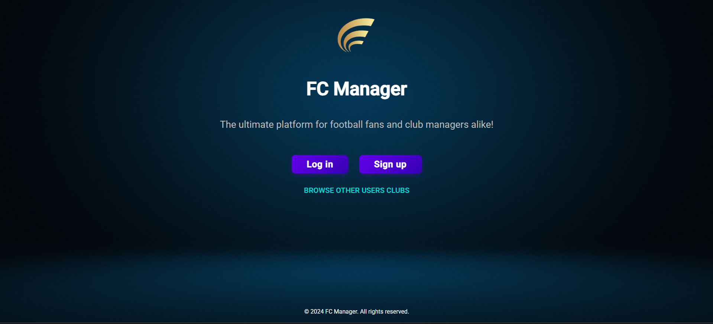
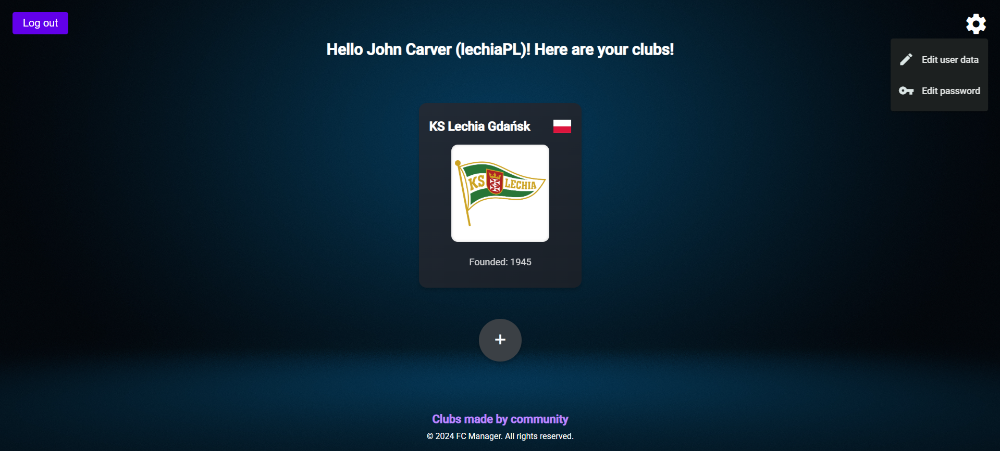
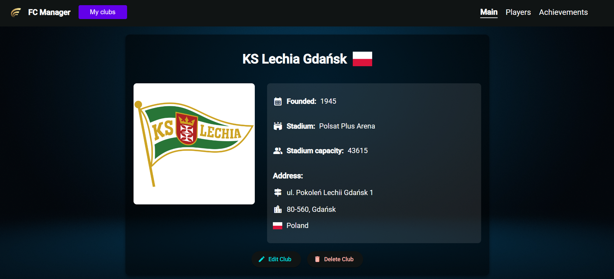
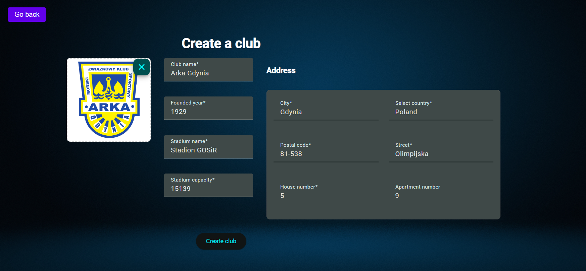
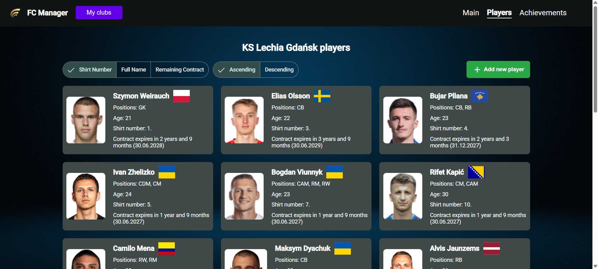
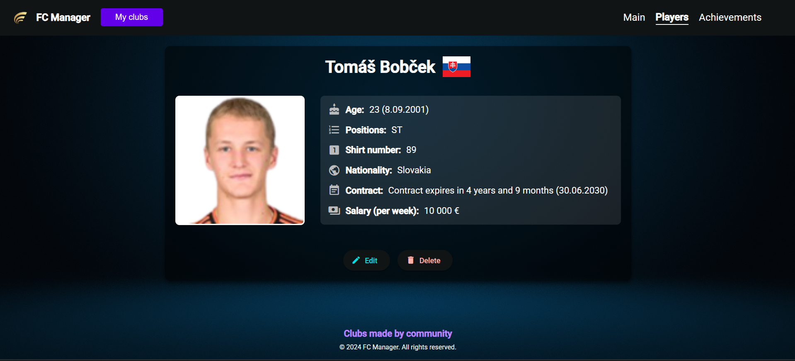
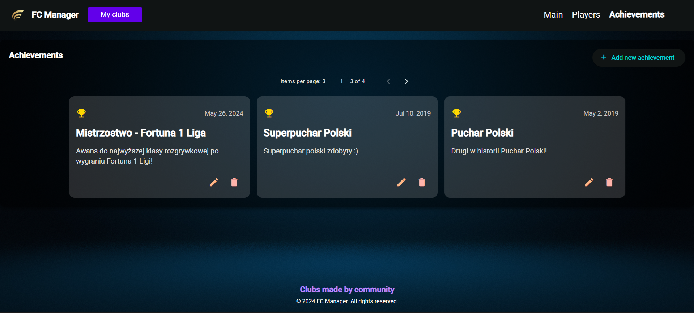
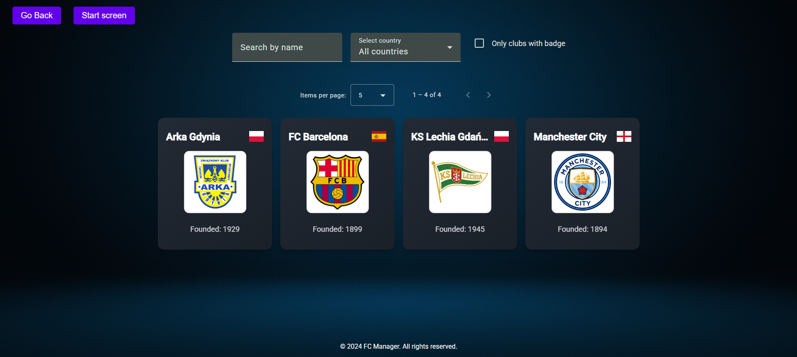

# FC Manager

Football club management application for managing clubs, players and club achievements. It also allows users to browse clubs created by other users.

## Technologies used:


## Run locally

Clone project
```bash
git clone https://github.com/kacper-holowaty/football_manager
```

Go to project directory
```bash
cd football_manager
```

Create `.env` file to set environment variables. Use the provided `.env.example` file as a reference.

Build and run the application using Docker Compose:
```bash
docker compose -f docker-compose.yml up --build --watch
```

The --watch flag enables automatic reload of the server when source files change.

The application will ba available on: **http://localhost:4200**

To stop application and remove containers and networks use:
```bash
docker compose -f docker-compose.yml down
```

## Preview

**Start screen**


**Main club owner view**


**Club main**


**Create club form**


**List of players**


**Player details**


**Club achievements**


**List of all clubs**
